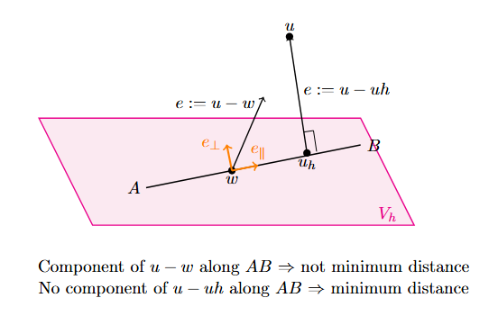
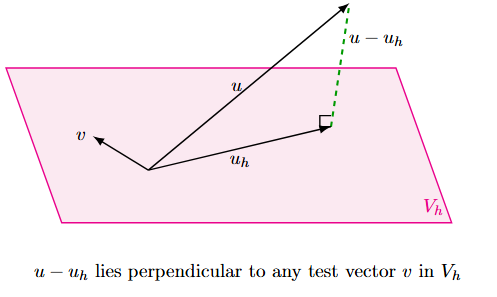

# Chapter 2 — Projections as Approximations

## 2.1 Motivation — Why Approximation is Geometric

From Chapter 1 we learned:
- A function is a vector in an infinite-dimensional vector space.- FEM replaces this space with a finite-dimensional subspace.- The FEM solution is a vector written in a function basis.
This raises a fundamental question:
> What does it mean to approximate a vector by another vector in a subspace?
In linear algebra, approximation is a projection problem.

---

## 2.2 Inner-Product-Induced Norms
A norm answers one question:
> How big is a vector?
An inner product answers another:
> How do two vectors relate geometrically? (angle, alignment, overlap)
In 2-D space, imagine a point $u$ and a line $V_h$ in the plane.  What is the closest point on the line?
> The foot of the perpendicular.

---

### 2.2.1 Definition

Let $V$ be a vector space with an inner product:

$$\langle \cdot,\cdot\rangle : V\times V \to \mathbb{R}.$$

Then we define a norm by:

$$\|v\| := \sqrt{\langle v,v\rangle}.$$

We instantly recognise that this is the $L^2$-norm in function space:

$$\langle u,v\rangle_{L^2} := \int_\Omega u(x)\,v(x)\,dx,$$

so the induced norm is

$$\|u\|_{L^2} = \sqrt{\int_\Omega u(x)^2\,dx}.$$

---
### 2.2.2 Geometry hierarchy
1. Inner product measures alignment / overlap:

   $\langle u,v\rangle$

3. Norm (length) comes from self-overlap:

   $\|v\|=\sqrt{\langle v,v\rangle}$

5. Distance between vectors:

   $d(u,v)=\|u-v\|=\sqrt{\langle u-v,u-v\rangle}$

To approximate a vector by another vector in a subspace, we minimize $d(u,v)$.

---

## 2.3 Approximation as a Minimization Problem

Given a vector $u$ and a subspace $V_h$, find $u_h\in V_h$ such that

$$u_h=\arg\min_{v\in V_h}\|u-v\|.$$

(Here: $u$ = input vector to be approximated, $v$ = test vector, $u_h$ = minimizer/best approximation.)

---

## 2.4 Orthogonality of the Error (Projection Theorem)

Define the error:

$$e := u-u_h$$

We are trying to approximate $u$ by vectors in $V_h$. The projection theorem states implies:

- \(u_h\) is the orthogonal projection of \(u\) onto \(V\).
- The residual \(r = u - u_h\) is orthogonal to the entire subspace \(V\).
- No tangential component remains.

To make this idea intuitive, consider a 2D space with a vector $AB$ where the goal is to find the minimum distance between a point $u$ and the vector $AB$. The closest point on the vector will be the foot of the perpendicular to the point $u$. For any other point $w$ along $AB$, the error vector $$e := u - w$$ will have a component along $AB$, and moving along that component leads us to the point $u_h$:

  

Now we extend this idea to a generalised vector space:

  

If any component of $e$ lies in the subspace $V_h$, then the problem is not minimized: there exists a direction $v\in V_h$ such that moving along $v$ reduces the error.
So, at the best approximation, we must have exhausted all directions in the subspace: no allowed movement in $V_h$ can reduce the distance.
Therefore the error must point entirely outside the subspace, i.e. it is orthogonal to $V_h$ and all test vectors $v$ in $V_h$:

$$\langle u-u_h,\; v\rangle = 0\quad \forall v\in V_h$$

This vector problem can be represented geometrically as:- $u$ : target vector  - $u_h$ : best approximation in the subspace  - $u-u_h$ : error vector  - $v$ : any test direction (in the solution space).

---
## 2.5 From Geometry to Algebra

Let

$$V_h=\mathrm{span}\{\phi_1,\phi_2,\dots,\phi_N\}.$$

Then the coordinate representation of the best solution in $V_h$ becomes:

$$u_h = \sum_{j=1}^{N} c_j \phi_j.$$

Since $v\in V_h$ is a linear combination of basis functions $\phi_i$, it is sufficient to enforce:

$$\langle u-u_h,\phi_i\rangle = 0\quad \forall i=1,2,\dots,N.$$

Substitute $u_h=\sum_{j=1}^{N}c_j\phi_j$:

$$\left\langle u-\sum_{j=1}^{N}c_j\phi_j,\;\phi_i\right\rangle = 0.$$

Using linearity in the first argument:

$$\langle u,\phi_i\rangle - \sum_{j=1}^{N}c_j\langle \phi_j,\phi_i\rangle = 0,$$

so

$$\boxed{\langle u,\phi_i\rangle = \sum_{j=1}^{N}c_j\langle \phi_j,\phi_i\rangle}.$$

$i$ : which test direction we enforce orthogonality against (row index)

$j$ : which basis function contributes to the approximation $u_h$ (column index)

Each fixed $i$ gives one scalar equation ($i=1$ first equation, …, $i=N$ $N$ th equation).

---

## 2.6 Recognising Structure

We observe that
- For each fixed $i$, this is a linear equation in the unknowns $c_j$: $$\sum_{j=1}^{N} c_j (\phi_j, \phi) = \langle u , \phi \rangle$$
- The quantities $\langle \phi_j, \phi_i \rangle$ are just numbers.
- These numbers are indexed by $i$ and $j$.

Therefore, we can organize them to map the test direction $\phi_i$ to the coefficient $c_j$.

For $i = 1$:

$$
c_1 \langle \phi_1, \phi_1 \rangle
+ c_2 \langle \phi_2, \phi_1 \rangle
+ c_3 \langle \phi_3, \phi_1 \rangle
+ \cdots
+ c_N \langle \phi_N, \phi_1 \rangle
= \langle u, \phi_1 \rangle
$$

For $i = 2$:

$$
c_1 \langle \phi_1, \phi_2 \rangle
+ c_2 \langle \phi_2, \phi_2 \rangle
+ \cdots
+ c_N \langle \phi_N, \phi_2 \rangle
= \langle u, \phi_2 \rangle
$$

$\vdots$

For $i = N$:

$$
c_1 \langle \phi_1, \phi_N \rangle
+ c_2 \langle \phi_2, \phi_N \rangle
+ \cdots
+ c_N \langle \phi_N, \phi_N \rangle
= \langle u, \phi_N \rangle
$$

We convert this to a matrix:

$$
\begin{bmatrix}
\langle \phi_1, \phi_1 \rangle & \langle \phi_2, \phi_1 \rangle & \cdots & \langle \phi_N, \phi_1 \rangle \\
\langle \phi_1, \phi_2 \rangle & \langle \phi_2, \phi_2 \rangle & \cdots & \langle \phi_N, \phi_2 \rangle \\
\vdots & \vdots & \ddots & \vdots \\
\langle \phi_1, \phi_N \rangle & \langle \phi_2, \phi_N \rangle & \cdots & \langle \phi_N, \phi_N \rangle
\end{bmatrix}
\begin{bmatrix}
c_1 \\
c_2 \\
\vdots \\
c_N
\end{bmatrix}

=

\begin{bmatrix}
\langle u, \phi_1 \rangle \\
\langle u, \phi_2 \rangle \\
\vdots \\
\langle u, \phi_N \rangle
\end{bmatrix}
$$

---

Explicitly:

- Row $i$ corresponds to "test with $\phi_i$".
- Column $j$ corresponds to $c_j$ multiplying $\phi_j$.
- Entry $(i,j)$ is the inner product:

$$
M_{ij} = \langle \phi_j, \phi_i \rangle
$$

Thus, the system becomes:

$$
M c = b
$$

---

## 2.7 The Matrix as Geometry

From the projection condition we obtained the linear system:

$$\sum_{j=1}^{N}\langle \phi_j,\phi_i\rangle c_j = \langle u,\phi_i\rangle\quad \text{for } i=1,2,\dots,N.$$

Define

$$M_{ij}:=\langle \phi_j,\phi_i\rangle, \quad b_i:=\langle u,\phi_i\rangle.$$

Then the system becomes

$$Mc=b.$$

Interpretation:

- $c\in\mathbb{R}^N$ contains the coordinates of the approximation $u_h$.- $M$ is not arbitrary — it is built entirely from inner products.- $M$ encodes how the basis functions overlap geometrically.
> The matrix is the inner-product geometry of the subspace written in coordinates.

---

### 2.8 Coordinate Space vs Function Space

Any function in the subspace can be written as:

$$u_h=\sum_{j=1}^{N}c_j\phi_j.$$

This establishes a mapping:

$$u_h \;\longleftrightarrow\; c=(c_1,c_2,\dots,c_N)\in\mathbb{R}^N.$$

- $u_h$ lives in the function space.- $c$ lives in the coefficient (coordinate) space $\mathbb{R}^N$.

The projection problem

$$\min_{v\in V_h}\|u-v\|$$

is equivalent to solving the algebraic system

$$Mc=b.$$

**Key message:**
> FEM computes coordinates, not functions.  > The function is reconstructed only after solving the algebraic problem.

---

## 2.9 Choice of Inner Product = Choice of Approximation

The quantities $\langle \phi_j,\phi_i\rangle$ are just numbers, indexed by $i$ and $j$,and can be organised into a matrix mapping test direction $\phi_i$ to coefficient $c_j$.

**Examples:**

1. $L^2$ inner product

$$\langle u,v\rangle = \int_\Omega u\,v\,dx \quad \Rightarrow \quad \text{minimizes } L^2 \text{ error}.$$

2. Gradient (energy) inner product

$$\langle u,v\rangle = \int_\Omega \nabla u\cdot \nabla v\,dx \quad \Rightarrow \quad \text{minimizes error in gradients}.$$

**Interpretation note:**

> The inner product defines what the error means.

---

## 2.10 Transition to PDEs

So far, we approximated a given vector $u$.

In PDEs:

$$Lu=f.$$

The unknown $u$ is constrained by an operator.

The next step is to project the operator equation, not just the solution.

**Key message:**

> Weak forms arise when operator equations are enforced through projection.

---

## 2.11 Some Notes on the Matrix $M$

Recall that the matrix $M$ was obtained when we expressed the vector minimization problem in coordinate form.

**Key message:**

> The linear system does not come from discretizing equations;  > it comes from expressing geometry in coordinates.

We have

$$M_{ij}=\langle \phi_j,\phi_i\rangle.$$

### Symmetry of $M$

We know $\langle a,b\rangle = \langle b,a\rangle$, so

$$M_{ij}=\langle \phi_j,\phi_i\rangle = \langle \phi_i,\phi_j\rangle = M_{ji}.$$

Hence $M$ is symmetric.

### Positive definiteness of $M$

Take any coefficient vector $c=(c_1,\dots,c_N)^T$ and build the function

$$v=\sum_{j=1}^{N}c_j\phi_j \in V_h.$$

Now compute:

$$c^T M c= \sum_{i=1}^{N}\sum_{j=1}^{N} c_i\,M_{ij}\,c_j= \sum_{i=1}^{N}\sum_{j=1}^{N} c_i\,\langle \phi_j,\phi_i\rangle\,c_j= \left\langle \sum_{j=1}^{N}c_j\phi_j,\;\sum_{i=1}^{N}c_i\phi_i \right\rangle= \langle 
v,v\rangle= \|v\|^2.$$

Now $\|v\|^2\ge 0$ always, and $\|v\|^2=0 \Rightarrow v=0$.

If $\{\phi_j\}$ are linearly independent, then $v=0 \Rightarrow c=0$.

So for $c\neq 0$, we get $\|v\|^2>0$.

Therefore:

$$\boxed{M \text{ is symmetric positive definite (SPD)}} \quad \Rightarrow \quad Mc=b \text{ has a unique solution}.$$

---

## 2.12 Conditioning of $M$

Poor conditioning comes from bad coordinates, not bad physics.

In exact mathematics, $Mc = b$ has a unique solution since $M$ is SPD.

In floating-point arithmetic, solving it depends on how sensitive $c$ is to small perturbations.

Introduce the condition number $k(M)$:
- $k(M) \approx 1$ $\Rightarrow$ very stable  - $k(M) \gg 1$ $\Rightarrow$ small errors in data or rounding create large errors in $c$

To see how ill-conditioning comes from coordinate choice, look at two basis functions $\phi_1, \phi_2$.
If they are almost the same direction, they are nearly linearly dependent:

$$\phi_2 \approx \alpha \phi_1.$$

Then

$$\langle \phi_1, \phi_2 \rangle \approx \alpha \langle \phi_1, \phi_1 \rangle,$$

so the overlap is huge.

That makes columns of $M$ nearly dependent, which makes $M$ close to singular:

$$k(M) \gg 1.$$

If the basis is orthonormal:

$$\langle \phi_i, \phi_j \rangle = \delta_{ij},$$

then

$$M = I, k(M) = 1$$

Even if $M$ is ill-conditioned, $u_h$ may still be reasonable, because the instability appears in the coefficients $c$, not the reconstructed function $u_h$.
The condition number $k(M)$ represents how much the geometry of the subspace is distorted by the chosen coordinates.
In PDEs, the operator $L$ changes the inner-product geometry, replacing the mass matrix with operator-dependent matrices.
